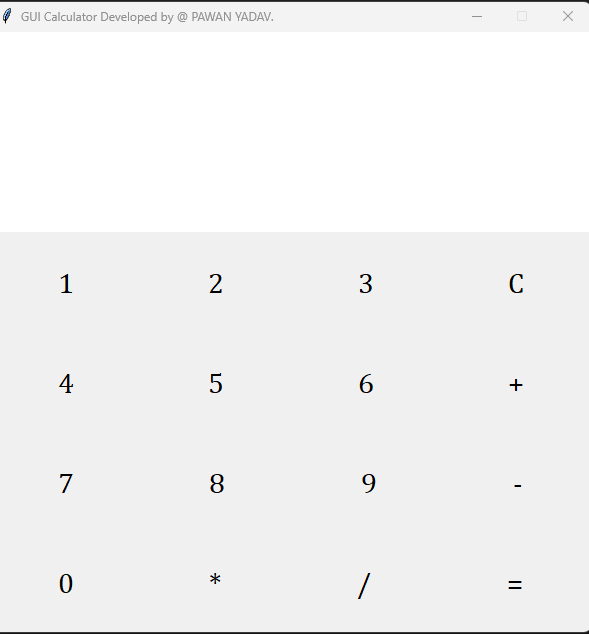

# GUI Calculator in Python using Tkinter

## 📌 Description

This is a simple **GUI Calculator** built using Python's `tkinter` library. It performs basic arithmetic operations like addition, subtraction, multiplication, and division. The interface is designed using `Frame`, `Button`, and `Label` widgets in `tkinter`.

---

## 🧰 Features

- Graphical User Interface
- Responsive buttons for digits (0–9)
- Operations supported:
  - Addition (+)
  - Subtraction (−)
  - Multiplication (×)
  - Division (÷)
- Error handling (e.g., division by zero)
- Clear (C) functionality
- Result display using `Label`

---

## 🖼️ GUI Preview



> *Add a screenshot of your calculator named `screenshot.png` in the project directory for this image to show.*

---

## 🚀 Getting Started

### Requirements

- Python 3.x

No external libraries are needed. Tkinter is included in the standard Python distribution.

---

### How to Run

1. Clone this repository or download the script file.
2. 

3. Run the script:
   ```bash
   python calculator.py
## 📁 Project Structure

calculator_project/

│
├── calculator.py         # Main Python file with Tkinter code
├── README.md             # Project documentation
└── screenshot.png        # (Optional) Screenshot of the calculator

## 📌 Notes

This calculator performs only simple two-operand calculations.

Use the = button to finalize operations.

For learning purposes, each button has a separate function.

Handles division by zero with a popup message box.

👨‍💻 Author

PAWAN YADAV
